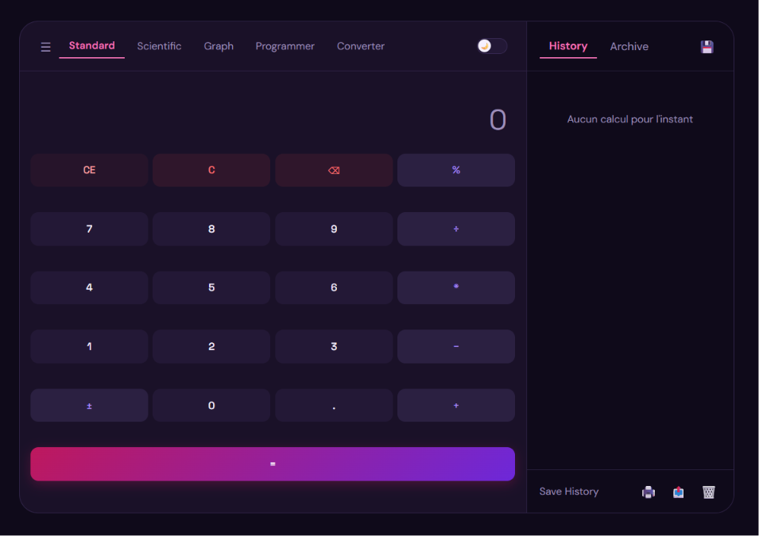
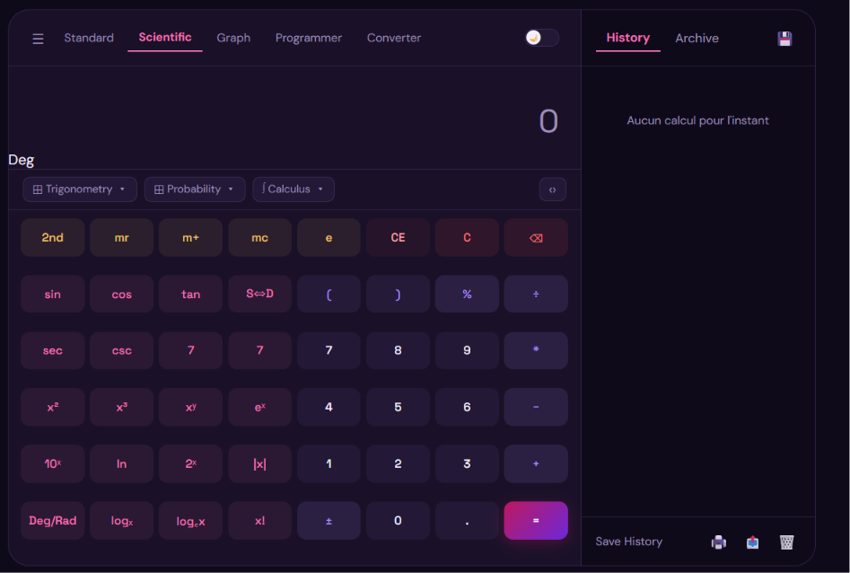
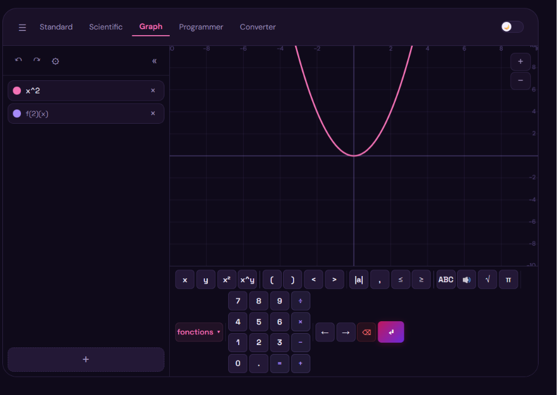
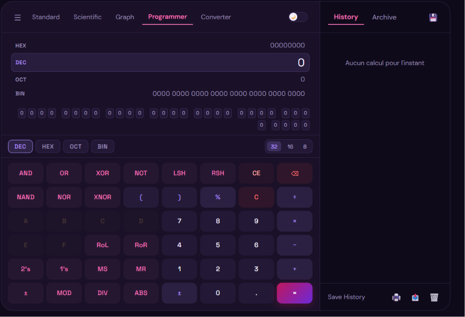

<div align="center">
  <h1>🧮 CALCULATRICE</h1>
  <p><strong>Calculatrice scientifique web multi-pages</strong><br>
  Standard · Scientific · Graph · Programmer · Converter</p>

  <p>
    
    
    
    
  </p>
</div>

---

## 📸 Aperçu





---

## ✨ Fonctionnalités

| Page | Description |
|------|-------------|
| **Standard** | Opérations de base : +, −, ×, ÷, %, ±, parenthèses, mémoire (MC/MR/M+/M–) |
| **Scientific** | Fonctions trigonométriques (sin, cos, tan & inverses), logarithmes, puissances, racines, factorielle, constantes (e, π), mode Deg/Rad, affichage exacte/décimal (S⇔D) |
| **Graph** | Traçage de fonctions multiples avec math.js, zoom/pan, undo/redo, clavier mathématique, affichage d'expressions par formule, grille dynamique |
| **Programmer** | Conversions HEX/DEC/OCT/BIN, opérations bit à bit (AND, OR, XOR, NOT, NAND, NOR, XNOR, LSH, RSH, RoL, RoR), compléments (1's, 2's), mots de 8/16/32 bits, visualiseur binaire |
| **Converter** | *(page à venir — bouton présent dans la navbar)* |

- **Historique & Archive** : chaque calcul est sauvegardé automatiquement (localStorage), avec onglets History/Archive, export, impression et vidange
- **Thème sombre/clair** : toggle accessible depuis toutes les pages
- **Responsive** : mise en page adaptative avec sidebar d'historique

---

## 🧱 Stack technique

| Couche | Technologie |
|--------|-------------|
| **Backend** | Python 3.10+ / Flask 3.0 (MVC léger) |
| **Frontend** | HTML5, CSS3, JavaScript vanilla |
| **Calculs** | [math.js](https://cdnjs.cloudflare.com/ajax/libs/mathjs/12.2.1/math.min.js) (CDN) – évaluation d'expressions et traçage |
| **Stockage** | localStorage pour l'historique et l'archive |
| **Structure** | MVC : `app.py` (routes) → `templates/` (vues HTML) → `static/` (CSS/JS) |

---

## 📁 Structure du projet

```
CALCULATRICE/
├── app.py                  # Application Flask (routes)
├── requirements.txt        # Dépendances Python
├── README.md               # Documentation
├── images/
│   └── interface.jpg       # Exemple de capture
├── static/
│   ├── style.css           # Styles généraux
│   ├── graph.css           # Styles page Graph
│   ├── programmer.css      # Styles page Programmer
│   ├── javascript.js       # Logique calculatrice Scientific & Standard
│   ├── graph.js            # Moteur de traçage avec zoom/pan
│   ├── programmer.js       # Logique calculatrice Programmer
│   ├── history.js          # Gestion historique & archive
│   ├── theme.js            # Bascule thème clair/sombre
│   └── btnComun.js         # Utilitaires boutons communs
└── templates/
    ├── index.html          # Page Scientific
    ├── standard.html       # Page Standard
    ├── graph.html          # Page Graph
    └── programmer.html     # Page Programmer 
```

---

## 🚀 Installation et lancement

### Prérequis

- Python 3.10 ou supérieur
- Git

### Étapes

```bash
# 1. Cloner le dépôt
git clone https://github.com/ASKceliaDEV/calculatrice-intelligente.git
cd CALCULATRICE

# 2. Créer un environnement virtuel
python -m venv venv

# 3. Activer l'environnement virtuel
#   Windows :
venv\Scripts\activate
#   macOS / Linux :
source venv/bin/activate

# 4. Installer les dépendances
pip install -r requirements.txt

# 5. Lancer l'application
python app.py
#   ou
flask run
```

L'application est accessible sur **http://localhost:5000**.

---

## 🖱️ Utilisation

| Page | URL | Usage |
|------|-----|-------|
| **Scientific** | `/` | Calculs avancés avec fonctions trigonométriques, logarithmes, etc. |
| **Standard** | `/standard` | Opérations arithmétiques simples |
| **Graph** | `/graph` | Saisir des fonctions (ex: `sin(x)`, `x^2`), zoomer avec la molette, déplacer en cliquant-glissant |
| **Programmer** | `/programmer` | Basculer entre HEX/DEC/OCT/BIN, effectuer des opérations bit à bit |

La sidebar droite affiche l'**historique** des calculs. Vous pouvez archiver, exporter, imprimer ou effacer l'historique depuis le pied de la sidebar.

---

## 👤 Auteur

**GitHub : [@ASKceliaDEV](https://github.com/mebdd)**

---

## 📄 Licence

Ce projet est distribué sous la licence **MIT**. Voir le fichier `LICENSE` pour plus d'informations.
